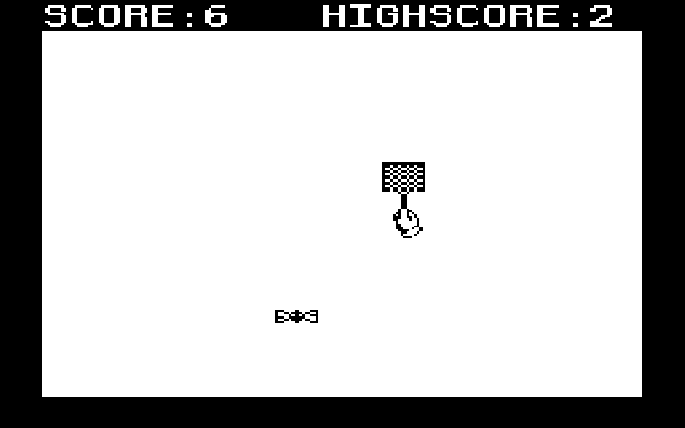

# Fly Swatter

## About

A game inspired by the Mario Paint minigame "Gnat Attack".  
Made with LOVE2D/LÖVE in lua.  
[itch.io Page](sleepycharlyy.itch.io/fly-swatter)  

## Screenshots

## Credits

Assets and Code made by [sleepycharlyy](https://github.com/sleepycharlyy).  
Inspired by the Mario Paint minigame  "Gnat Attack".  
Uses the [LÖVE Engine](https://github.com/love2d/love).  
Font: [duckinator/awoof](https://github.com/duckinator/awoof) under MIT License.  

## License

This project is under the GNU General Public License v3.0.
